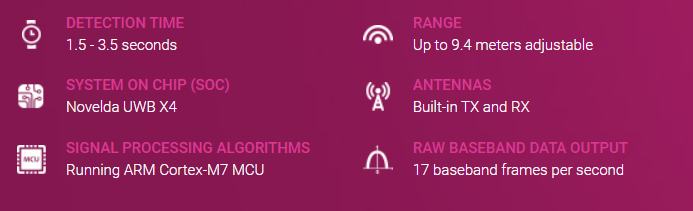
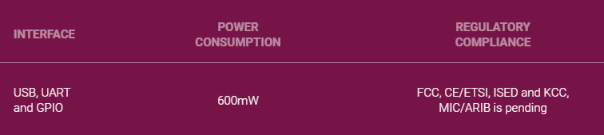
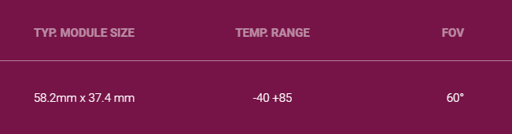
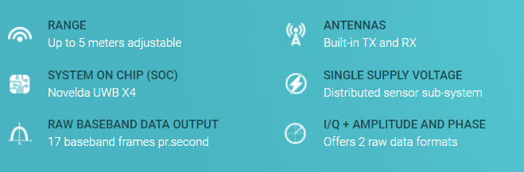
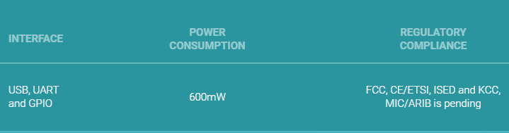
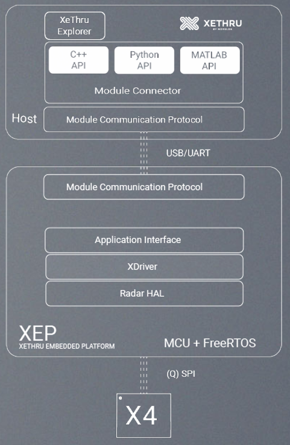

# 基于无线电的呼吸监测

## 1. 硬件型号与特点

### 1.1 XETHRU X4

The X4 is an Impulse Radar Transceiver System on Chip (SoC) combining a 7.29/8.748 GHz transmitter for unlicensed operation in worldwide markets, a direct RF-sampling receiver, a fully programmable system controller and advanced power management functions in a single chip.

Novelda’s XeThru X4 is an ultra wide band (UWB) impulse radar chip. It provides product developers with sub-mm movement sensing accuracy at distances from 0 to 25 meters depending on target size.

### 1.2 X4M03

### 1.3 X4M300

The XeThru **X4M300** is Novelda’s **presence and occupancy** sensor powered by the XeThru X4 ultra wide band radar chip. Ultra sensitive and with excellent signal to noise performance, the sensor detects even the smallest human movement in a room.What’s more, the sensor’s presence detection zone is fully programmable, and can be configured up to a distance of 9.4 metres. The sensor also accurately measures the distance to occupants.

> URL: https://www.xethru.com/x4m300-presence-sensor.html
>
> URL: https://www.xethru.com/occupancy-sensing.html

### 1.4 X4M200

The XeThru **X4M200** is Novelda’s respiration sensor powered by the XeThru X4 system on chip. The standard **sleep and respiration monitoring** abilities are integrated in the sensor and provide advanced respiration and movement tracking both during the day and throughout the night. The programmable detection range up to **5 meters** is a key feature for the sensor.

> URL: https://www.xethru.com/x4m200-respiration-sensor.html
>
> URL: https://www.xethru.com/respiration-monitoring.html/

### 1.5 XeThru Module Connector

XeThru Module Connector is the **host software**(主机软件) for communicating between the X4M03 / X4M06 development kits or other XeThru radar sensors.

Module Connector runs on Windows, Max, Linux and embedded hosts, and presents a **complete API** of the sensor module in **MATLAB**, **Python** and **C++** programming environments. This makes it easy to start streaming and analysing radar data on multiple levels (raw radar, baseband, pulse Doppler , detection list, respiration and presence data) and **developing new algorithms.**

### 1.6 XeThru Embedded Platform (XEP)

**XeThru Embedded Platform (XEP)** is the **embedded software** running on the X4M03, X4M06 and X4M02 radar development kits to enable occupancy, respiration monitoring and other customs applications.

XEP is **open source** and comes as a **ready-to-go(现成的) Atmel Studio 7 project.** It implements all core functionalities for easy hardware module implementation. A compiled version of XEP is also provided and **runs out-of-the-box** with the following functionalities:

- **Module Communication Protocol** is the host communication layer including message parsing(消息解析) to make it **easy to extend the API** and **tailor(定制)** system behaviour.
- X4Driver – The API layer providing developers with direct access to all XeThru X4 SoC functionalities. It enables tailoring of radar parameters and performance to match specific project needs and is accessed from host computer via XMC.
- Well-defined access points for **digital signal processing libraries** to tap into X4’s radar data stream and boost system performance.
- **FreeRTOS** for real time system behaviour monitoring and management.

