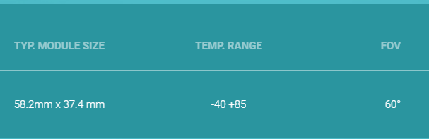

# 基于无线电的呼吸监测

## 1. 硬件型号与特点

### 1.1 XETHRU X4

The X4 is an Impulse Radar Transceiver System on Chip (SoC) combining a 7.29/8.748 GHz transmitter for unlicensed operation in worldwide markets, a direct RF-sampling receiver, a fully programmable system controller and advanced power management functions in a single chip.

Novelda’s XeThru X4 is an ultra wide band (UWB) impulse radar chip. It provides product developers with sub-mm movement sensing accuracy at distances from 0 to 25 meters depending on target size.

### 1.2 X4M03

### 1.3 X4M300

The XeThru **X4M300** is Novelda’s **presence and occupancy** sensor powered by the XeThru X4 ultra wide band radar chip. Ultra sensitive and with excellent signal to noise performance, the sensor detects even the smallest human movement in a room.What’s more, the sensor’s presence detection zone is fully programmable, and can be configured up to a distance of 9.4 metres. The sensor also accurately measures the distance to occupants.

> URL: https://www.xethru.com/x4m300-presence-sensor.html
>
> URL: https://www.xethru.com/occupancy-sensing.html

### 1.4 X4M200

The XeThru **X4M200** is Novelda’s respiration sensor powered by the XeThru X4 system on chip. The standard **sleep and respiration monitoring** abilities are integrated in the sensor and provide advanced respiration and movement tracking both during the day and throughout the night. The programmable detection range up to **5 meters** is a key feature for the sensor.

> URL: https://www.xethru.com/x4m200-respiration-sensor.html
>
> URL: https://www.xethru.com/respiration-monitoring.html/

### 1.5 XeThru Module Connector

XeThru Module Connector is the **host software**(主机软件) for communicating between the X4M03 / X4M06 development kits or other XeThru radar sensors.

Module Connector runs on Windows, Max, Linux and embedded hosts, and presents a **complete API** of the sensor module in **MATLAB**, **Python** and **C++** programming environments. This makes it easy to start streaming and analysing radar data on multiple levels (raw radar, baseband, pulse Doppler , detection list, respiration and presence data) and **developing new algorithms.**

### 1.6 XeThru Embedded Platform (XEP)

**XeThru Embedded Platform (XEP)** is the **embedded software** running on the X4M03, X4M06 and X4M02 radar development kits to enable occupancy, respiration monitoring and other customs applications.

XEP is **open source** and comes as a **ready-to-go(现成的) Atmel Studio 7 project.** It implements all core functionalities for easy hardware module implementation. A compiled version of XEP is also provided and **runs out-of-the-box** with the following functionalities:

- **Module Communication Protocol** is the host communication layer including message parsing(消息解析) to make it **easy to extend the API** and **tailor(定制)** system behaviour.
- X4Driver – The API layer providing developers with direct access to all XeThru X4 SoC functionalities. It enables tailoring of radar parameters and performance to match specific project needs and is accessed from host computer via XMC.
- Well-defined access points for **digital signal processing libraries** to tap into X4’s radar data stream and boost system performance.
- **FreeRTOS** for real time system behaviour monitoring and management.

## 2. INTRODUCTION TO RADAR SIGNAL PROCESSING

> Reference: INTRODUCTION TO RADAR SIGNAL PROCESSING, Christos llioudis

### 2.1 Basic principles

- Radar is an acronym for **RA**dio **D**etection **A**nd **R**anging. 
- Radar is an object detection system that transmits electromagnetic(EM) waves and analyses the echoes coming from the objects.

### 2.2 Radar Categorisation(分类)

> 可以从以下四个角度分类

- #### Operation

  - Primary: Target monitoring

  - Secondary: Transponder on the target **(Fig following)**

    

- #### Illuminator

  - Active: Uses its transmitter to illuminate the target

  - Passive: Exploit illuminators of opportunity **(Fig following)**

    

- #### Transmission rate

  - Pulsed: Emit separated pulses

  - Continuous Wave (CW): Constant transmission**(Fig following)**

    

- #### Geometry

  - Monostatic(单站): Transmitter and receiver in the same location **(Fig. Left)**

  - Bistatic(双站): Transmitter and receiver in separate locations **(Fig. Right)**

    

### 2.3 Operating Principles

### 2.4 Principles of Measurements

#### 2.4.1 Radar Equation

The radar equation is referring to the power of the echo returning to the radar:
$$
P_{r}=\frac{P_{t} G^{2} \lambda^{2} \sigma}{(4 \pi)^{3} R^{4} L} \rightarrow R=\sqrt[4]{\frac{P_{t} G^{2} \lambda^{2} \sigma}{(4 \pi)^{3} L P_{r}}}
$$
$P_{t}$ : Transmit power

$G$ : Antenna gain

$\lambda$ : Radar operating wavelength

$\sigma$ : Target radar cross section (RCS)

$R$ : Range from the radar to the target

$L$: Other losses (system, propagation)

> 雷达截面积(Radar Cross Section, RCS)是目标在雷达接收方向上反射雷达信号能力的度量，一个目标的RCS等于单位立体角目标在雷达接收天线方向上反射的功率(每单独立体角)与入射到目标处的功率密度(每平方米)之比。

Low frequencies are preferable for long-range radar. Low RCS targets are harder to detect.

#### 2.4.2 Distance Determination

#### 2.4.3 Range Resolution

#### 2.4.4 Direction Determination

#### 2.4.5 Pulse Repetition Interval

Pulse Repetition Interval (PRI) is defined as the time interval between consequent(后续) pulses.

#### 2.4.6 Maximum Unambiguous Ranges

The maximum unambiguous range defines the maximum distance to locate a target.
$$
R_{\max }=\frac{c \mathrm{PRI}}{2}=\frac{c}{2 \mathrm{PRF}}
$$
Radar is not able to discriminate between echoes from an older and the current transmission.

#### 2.4.7 Data Matrix and Data Cube

### 2.5 Coherent and Doppler processing

#### 2.5.1 Spectrum of Continuous Wave Signal

Consider a continuous wave (CW) radar with operating frequency $f_0$. In the presence of a target moving with radial velocity $u_r$, due to the **Doppler phenomenon**, the echoed signal will be shifted in frequency by:
$$
f_{D}=\frac{u_{r}}{c} f_{0}
$$
Positive Doppler shifts ($f_D > 0$) indicate that the target is moving **towards** the radar, while negative ($f_D < 0$) **away** from it.

#### 2.5.2 Spectrum of Pulsed Signal

In most radar systems, the bandwidth of single pulse may be a few **orders of magnitude**(数量级) greater than the expected Doppler frequency shift:
$$
\frac{1}{T} \gg f_{D}
$$
Echoes from moving targets cannot be discriminated(鉴别) from stationary clatter in spectrum. Using consequent pulsed over a coherent pulse interval (CPI), the single pulse bandwidth is divided into spectral line of approximate bandwidth $1/{CPI}$

#### 2.5.3 Range-Doppler Maps

